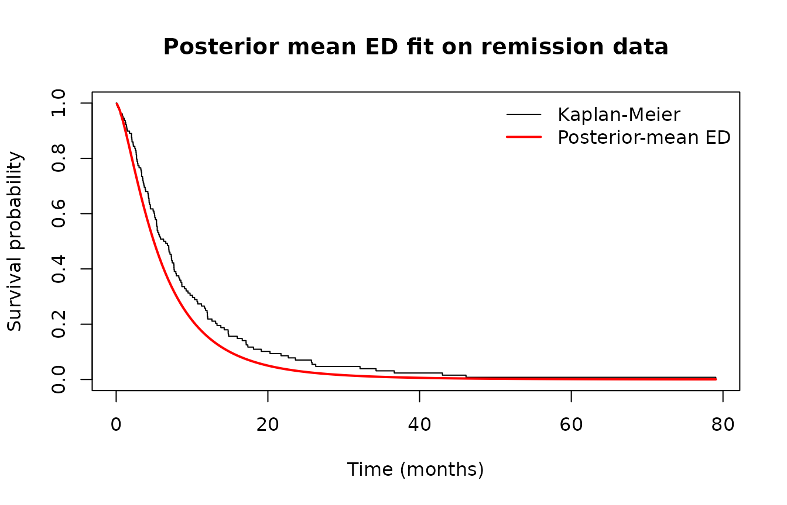

# Bayesian Estimation with BetaDanish

## 1. Overview

This vignette walks through Bayesian estimation of the three-parameter
Exponentiated Danish (ED) submodel and the full four-parameter
Beta-Danish distribution using
[`bayes_betadanish()`](https://bilal-aiou.github.io/BetaDanish/reference/bayes_betadanish.md).

## 2. ED submodel on bladder cancer remission times

``` r

library(BetaDanish)
data("remission")
fit_bayes <- bayes_betadanish(
  time     = remission$time,
  status   = remission$status,
  submodel = TRUE,
  burnin   = 2000, mcmc = 5000,
  tune     = 0.5,
  seed     = 1
)
#> 
#> 
#> @@@@@@@@@@@@@@@@@@@@@@@@@@@@@@@@@@@@@@@@@@@@@@@@@@@@@@@@@
#> The Metropolis acceptance rate was 0.67971
#> @@@@@@@@@@@@@@@@@@@@@@@@@@@@@@@@@@@@@@@@@@@@@@@@@@@@@@@@@
print(fit_bayes)
#> 
#> Beta-Danish Bayesian Fit (3-Parameter ED Submodel)
#> Random-walk Metropolis via MCMCpack::MCMCmetrop1R
#> 
#> 
#> Iterations = 1:5000
#> Thinning interval = 1 
#> Number of chains = 1 
#> Sample size per chain = 5000 
#> 
#> 1. Empirical mean and standard deviation for each variable,
#>    plus standard error of the mean:
#> 
#>      Mean      SD  Naive SE Time-series SE
#> b 5.22494 3.07019 0.0434190       0.242192
#> c 1.53540 0.27271 0.0038567       0.020974
#> k 0.06975 0.04315 0.0006103       0.003295
#> 
#> 2. Quantiles for each variable:
#> 
#>      2.5%     25%     50%     75%   97.5%
#> b 2.34806 3.37466 4.37153 5.92385 14.7311
#> c 1.10766 1.33060 1.50091 1.69558  2.1673
#> k 0.01368 0.03736 0.06127 0.09223  0.1766
#> 
#> 
#> 95% HPD intervals:
#>         lower      upper
#> b 1.930001455 11.3777080
#> c 1.060715381  2.0757817
#> k 0.007077114  0.1560365
#> attr(,"Probability")
#> [1] 0.95
```

## 3. Posterior diagnostics

``` r

draws <- fit_bayes$draws
op <- par(mfrow = c(3, 1), mar = c(3, 4, 2, 1))
coda::traceplot(draws)
```


``` r

par(op)
```

## 4. Posterior survival vs Kaplan-Meier

``` r

post_mean <- summary(draws)$statistics[, "Mean"]
b <- post_mean["b"]; c <- post_mean["c"]; k <- post_mean["k"]
km <- survival::survfit(survival::Surv(time, status) ~ 1, data = remission)
plot(km, conf.int = FALSE, xlab = "Time (months)",
     ylab = "Survival probability",
     main = "Posterior mean ED fit on remission data")
t_grid <- seq(0.1, max(remission$time), length.out = 200)
S_post <- pbetadanish(t_grid, a = 1, b = b, c = c, k = k,
                      lower.tail = FALSE)
lines(t_grid, S_post, col = "red", lwd = 2)
legend("topright",
       legend = c("Kaplan-Meier", "Posterior-mean ED"),
       col = c("black", "red"), lty = 1, lwd = c(1, 2), bty = "n")
```



## 5. Bayesian vs MLE comparison

``` r

fit_mle <- fit_betadanish(survival::Surv(time, status) ~ 1,
                          data = remission, submodel = TRUE,
                          n_starts = 3)
cbind(
  MLE  = round(coef(fit_mle), 4),
  Bayes_post_mean = round(post_mean, 4)
)
#>      MLE Bayes_post_mean
#> b 4.2304          5.2249
#> c 1.5256          1.5354
#> k 0.0648          0.0697
```
