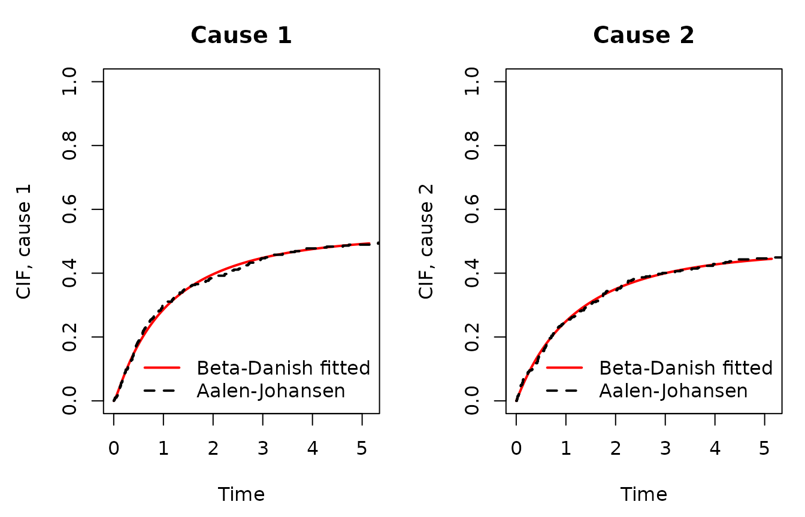

# Competing Risks with the Beta-Danish Distribution

## Overview

Under independent latent failure times, the joint competing-risks
likelihood factorises into one Beta-Danish marginal per cause. This
vignette demonstrates fitting and diagnostic plotting.

If `cmprsk` is not installed, code chunks below are skipped.

## Simulated two-cause data

``` r

library(BetaDanish)
set.seed(2026)
n  <- 400
T1 <- rbetadanish(n, a = 1.2, b = 1.5, c = 1.0, k = 0.4)
T2 <- rbetadanish(n, a = 1.0, b = 2.0, c = 1.0, k = 0.2)
C  <- stats::rexp(n, 0.05)
time  <- pmin(T1, T2, C)
cause <- ifelse(time == C, 0L, ifelse(T1 <= T2, 1L, 2L))
table(cause)
#> cause
#>   0   1   2 
#>  23 198 179
```

## Fitting the model

``` r

fit <- fit_bd_competing(time = time, cause = cause)
print(fit)
#> 
#> Call:
#> fit_bd_competing(time = time, cause = cause)
#> 
#> Beta-Danish Competing Risks Model
#> Log-Likelihood: -797.6223 
#> 
#> Coefficients:
#>               a       b      c      k
#> Cause_1 32.4368 39.6297 0.0891 0.0001
#> Cause_2 15.1288  2.1291 0.0783 0.1369
```

## CIF comparison: Beta-Danish vs Aalen-Johansen

``` r

res <- cif_compare(fit, plot = TRUE)
```



## Gray’s test

``` r

if (!is.null(res$gray_test)) {
  print(res$gray_test)
} else {
  cat("Gray's test was not produced.\n")
}
#> Gray's test was not produced.
```
