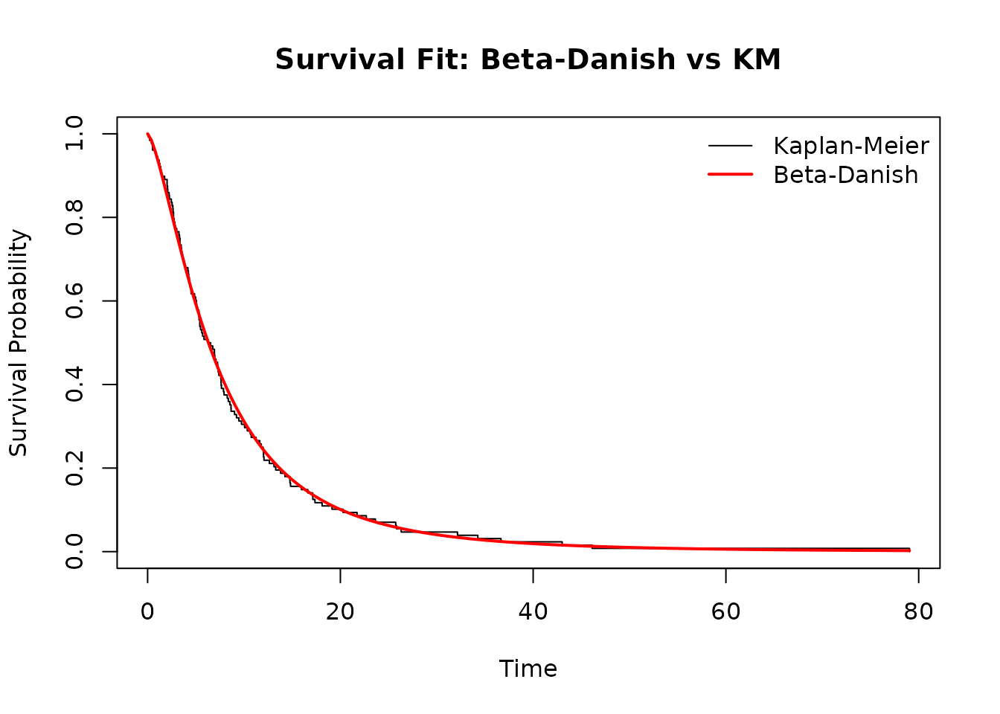
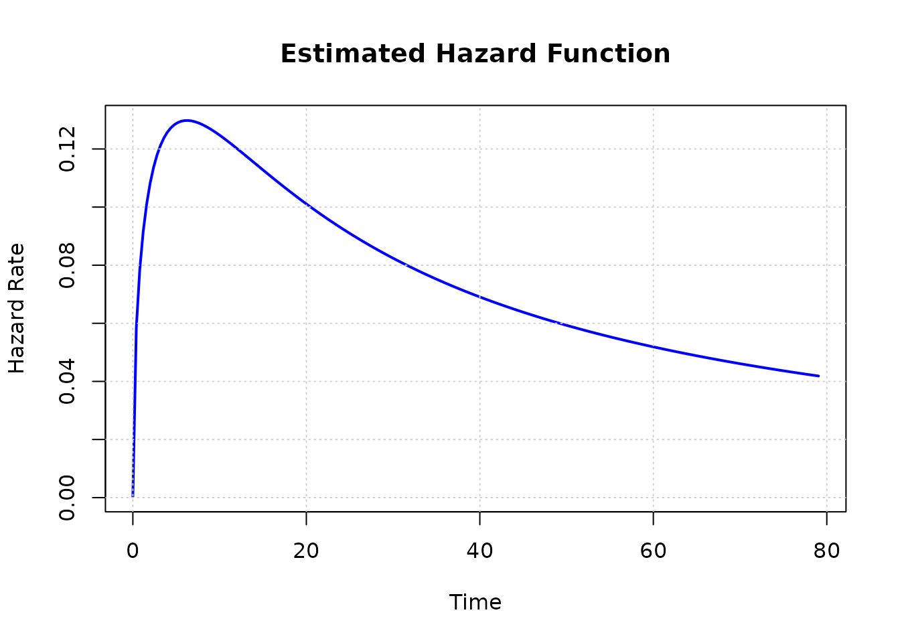

# A Case Study Using the Beta-Danish Distribution

## Introduction

This vignette demonstrates a typical survival analysis workflow using
the BetaDanish package.

``` r

library(BetaDanish)
#> BetaDanish 0.2.0: see ?BetaDanish for help.
library(survival)
#> 
#> Attaching package: 'survival'
#> The following objects are masked from 'package:BetaDanish':
#> 
#>     leukemia, transplant
data('remission', package = 'BetaDanish')
head(remission)
#>   time status
#> 1 0.08      1
#> 2 2.09      1
#> 3 3.48      1
#> 4 4.87      1
#> 5 6.94      1
#> 6 8.66      1
```

## Fitting the Beta-Danish model

``` r

fit <- fit_betadanish(Surv(time, status) ~ 1, data = remission, n_starts = 1)
summary(fit)
#> 
#> Call:
#> fit_betadanish(formula = Surv(time, status) ~ 1, data = remission, 
#>     n_starts = 1)
#> 
#> Beta-Danish Distribution Fit
#> Model: Full 4-Parameter Model 
#> 
#>    Estimate Std. Error Lower 95% Upper 95% z value Pr(>|z|)   
#> a  0.684431   0.984516 -1.245220  2.614082  0.6952 0.486933   
#> b  4.076536   1.516752  1.103701  7.049370  2.6877 0.007195 **
#> c  2.203261   3.204715 -4.077981  8.484503  0.6875 0.491764   
#> k  0.083149   0.091415 -0.096024  0.262321  0.9096 0.363044   
#> ---
#> Signif. codes:  0 '***' 0.001 '**' 0.01 '*' 0.05 '.' 0.1 ' ' 1
#> ---
#> Log-Likelihood: -409.9137 
#> AIC: 827.8274  | BIC: 839.2356
```

## Three-parameter submodel

``` r

fit_sub <- fit_betadanish(Surv(time, status) ~ 1, data = remission, submodel = TRUE, n_starts = 1)
compare_models(fit, fit_sub)
#> Likelihood Ratio Test (a = 1 vs a != 1)
#> 
#>                  Model    LogLik      Chisq Df Pr(>Chisq)
#> 1   Submodel (3-param) -409.9541         NA NA         NA
#> 2 Full Model (4-param) -409.9137 0.08080372  1  0.7762112
```

## Diagnostic plots

``` r

plot(fit, type = 'survival')
```



``` r

plot(fit, type = 'hazard')
```



## Interpretation

The fitted model can be used to estimate survival probabilities, hazard
behavior, and overall model fit. Users should compare the Beta-Danish
model with alternative lifetime distributions and inspect diagnostic
plots before drawing final conclusions.
